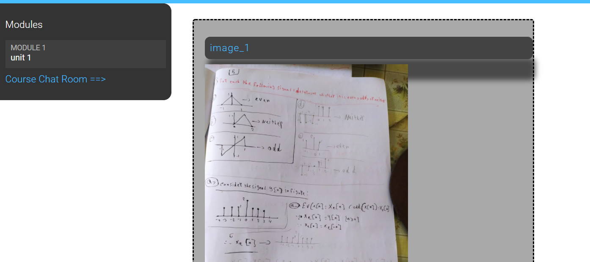
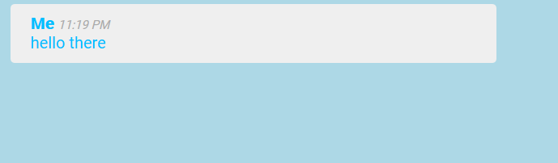
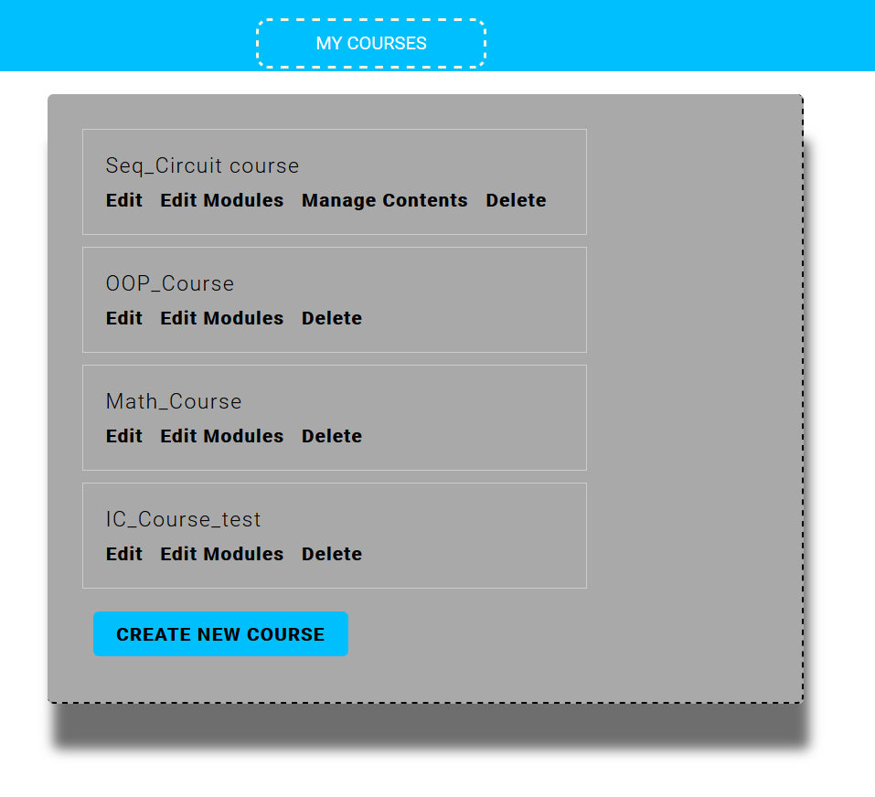
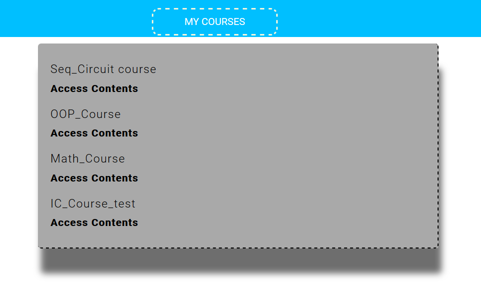

### Technologies
- Django
- django-braces
- django-embed-video
- django-memcached-status
- Django REST framework 
- Jquery
- jQuery UI
- MemCache
  - python binding: 
      `python-memcached`
- channels
- Redis 
- channels-redis
---

<h3>Images</h3>

    

- Home Page

----
---
- Course Enroll Page

----
---
- course page

----
---
- chat room

----
---
- Teacher Courses

----
---
- Student Courses

----
---
- Api subjects List

----
---
- Api Content of a course

----
---

----
<h3>urls :</h3>

- ### `/`
    - ##### `Courses List` 
        - view : `courses/views.py#CourseListView`
        - template : `courses/course/list.html` 
        - all the courses and a list of all the subjects to only show courses belonging to this Subject
            - every subject has the number of courses it has
            - evert course card show :
                - subject the course belong to
                - number of modules in the course
                - name of the Instructor
-----
----
- ### `/accounts`
    - `/login` :
        - login page
    - `/logout` :
        - logout page 
    - ##### views :
        - `django.contrib.auth`
            - `LoginView`
            - `LogoutView`
    - ##### note :
        - the templates for the two pages are overridden using :
            - `templates/registration/`
               - `login.html`
               - `logged_out.html`
---
----
- ### `/admin` 
    - need to be a superuser to access the admin panel
    - only a superuser can add new subjects or make a user a teacher by giving them the right permission
        - a teacher can add new courses and add modules and content to the courses he owns
    - ##### views 
        - `django.contrib.admin.site.urls`
----
----
- ### `course/`
    - `include('courses.urls')` : 
        - all urls under the courses' app start with `course/`
-----
- #### `mine/` (Login Require)
    - list of the courses the user (teacher) created
      - can edit the course, 
      - edit its modules, 
      - manging the content of a module,
      - deleting a course,
      - creating a new course,
        
    - view : `ManageCourseListView`
    - template : `courses/manage/course/list.html`
-----
- #### `create/` (Login Require)
    - ####### create a new course
    - view : `CourseCreateView`
    - template : `courses/manage/course/form.html` 
-----
- #### `<course_id>/edit/` (Login Require)
    - edit the info of an existing course
    - view : `CourseUpdateView`
    - template : `courses/manage/course/form.html` 
-----
- #### `<course_id>/delete/` (Login Require)
    - delete an existing course
    - view : `CourseDeleteView`
    - template : `courses/manage/course/delete.html`
-----
- #### `<course_id>/module/` (Login Require)
    - adding, editing and deleting modules of a course
    - view : `CourseModuleUpdateView`
    - template : `courses/manage/module/formset.html`     
-----
- #### `module/<course_id>/` (Login Require)
    - adding, editing and deleting content of a module in the course
    - view : `ModuleContentListView`
    - template : `courses/manage/content/content_list.html`
-----
- #### `module/<module_id>/content/<content_type>/create/` (Login Require)
    - adding a new content (text, image, video, file) to the module 
    - view : `ContentCreateUpdateView`
    - template : `courses/manage/content/form.html`
-----
- #### `module/<module_id>/content/<content_type>/<content_id>/` (Login Require)
    - editing a content item (text, image, video, file) from the module content 
    - view : `ContentCreateUpdateView`
    - template : `courses/manage/content/form.html`
-----
- #### `content/<content_id>/delete` (Login Require)
    - deleting a content item from the module
    - view : `ContentDeleteView`
    - template : no template (just delete and redirect again to the content_list page)
-----
- #### Note :
    - you can reorder the contents, or the modules 
            - just click and hold then drag to change the order
----
----
## `/students` :
- `student.urls`
  
- ### `register/` :
    - create a new user account
    - view : StudentRegistrationView
    - template : `students/student/registration.html`
---
- ### `courses/` : (Login Require)
    - list of all the courses the user is enrolled in
    - view : `StudentCourseListView`
    - template : `students/student/list.htm`
---
- ### `courses/<course_id>/` : (Login Require)
    - course detail page + course chat room 
    - view : `StudentCourseDetailView`
    - template : `students/student/detail.html`
---
- ### `courses/<course_id>/<module_id>` : (Login Require) 
    - showing the contents of a course module
    - view : `StudentCourseDetailView`
    - template : `students/student/detail.html`
---
---
## `chat/`
- the chat rooms of courses
- ### `room/<course_id>`
    - view : `course_chat_room`
    - template : `chat/room.html`

----
----
## `api/`
- ### the endpoints of the API 
    - `subjects/`
         - GET : return a list of all the subjects   
    - `subjects/<subject_id>`
         - GET : return the details of a subject   

    - `courses`
        - GET : list of all the course
    - `courses/<course_id>`
        - GEt : the details of a course
    - `courses/<course_id>/enroll/`
        - POST : enroll in a course
---
---

